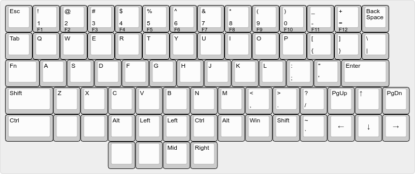

# KokiCraft v1

## Layout

The layout is designed using [Keyboard Layout Editor](http://www.keyboard-layout-editor.com/) and generated using [swillkb](http://builder.swillkb.com/).

The design is aimed to having no keys that is longer or equal to 2 sized key and as compact as possible. It resembles standard layout for letters while making use of thumbs to press important function keys like `Ctrl` and `Alt` (instead of hurting your pinkies). The keyboard is intended to use without mouse and with Thinkpad Trackpoints, so you get left, right, and middle keys directly from the keyboard.

